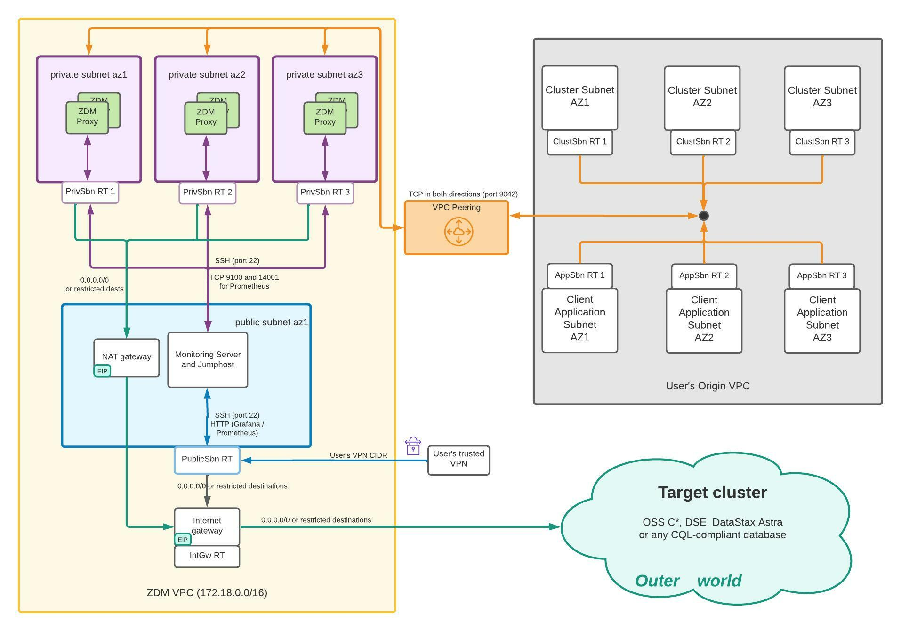

# ZDM Proxy Automation

### _An automation suite to deploy and manage the [Zero Downtime Migration Proxy](https://github.com/datastax/zdm-proxy)_

## Important note
This automation is being widely used by DataStax as part of the Zero Downtime Migration suite. The Ansible automation and the ZDM Utility have been used in numerous migrations of large-scale production environments and we are actively evolving them. They are also fully documented in the [official ZDM Documentation](https://docs.datastax.com/en/astra-serverless/docs/migrate/introduction.html).

All the automation material in this repository is licensed under the Apache Licence v2.0. Feel free to clone this repository and use this material as it is, as well as fork it and adapt it as appropriate if your environment or deployment strategy preferences are different.

We endeavor to expand and maintain this automation to ensure it works as expected, and we welcome suggestions from the community. However, we cannot always guarantee that we will implement feature requests or review and merge community contributions in a defined timeframe.

## Overview

The Zero Downtime Migration Proxy [(ZDM proxy)](https://github.com/datastax/zdm-proxy) is an open-source component written in Go and designed to seamlessly handle the real-time client application activity while the client application's data is being migrated between CQL clusters (which we will refer to as Origin and Target). For comprehensive documentation on how to use the ZDM Proxy to perform a zero-downtime migration, please see the [official ZDM Documentation](https://docs.datastax.com/en/astra-serverless/docs/migrate/introduction.html).

This automation suite provides several components to make it easier to provision, deploy and manage a cluster of ZDM Proxy instances in development, test and production environments.

The components in this suite are:
* A collection of Ansible playbooks to create a ZDM Proxy deployment and its companion monitoring stack, perform operations (configuration changes, version upgrades and simple restarts) in a rolling fashion, and collect the logs from all instances.
* An interactive utility to easily create and configure a Docker container that acts as the Ansible Control Host, from which the Ansible playbooks can be configured and run. The ZDM Utility is written in Go and can be run on any platform.
* A set of Terraform modules that can be **optionally** used to provision the infrastructure for a standard, self-contained ZDM deployment in a dedicated VPC, with some orchestration scripts to easily configure and run the Terraform automation. The Terraform automation is currently available for AWS only. Alternatively, you can provision the ZDM infrastructure in other ways (manually or through your own automation) as long as it complies with these [infrastructure and connectivity requirements](https://docs.datastax.com/en/astra-serverless/docs/migrate/deployment-infrastructure.html).
* A Docker Compose descriptor and set of scripts to easily create a local ZDM Proxy setup connecting to two single-node Cassandra clusters for testing and exploration purposes.
* Some additional convenience scripts.

## Versioning

We follow the format of semantic versioning (i.e. `major.minor.patch`) but major and minor versions are determined by zdm-proxy so that users can more easily know which version of the automation they need for a specific zdm-proxy version. Patch versions are independent though.

In practice this means that if we make a change to the `zdm-proxy-automation` ONLY, then we just bump the patch version (e.g. `zdm-proxy-automation 2.3.1 -> 2.3.2`) of the automation and we don't release `zdm-proxy`.

If we release a patch version of `zdm-proxy` (e.g. `zdm-proxy 2.4.0 -> 2.4.1`) then we do NOT release a new version of `zdm-proxy-automation`. We ensure that any `zdm-proxy` change that requires a change to the automation will only occur in a minor or major `zdm-proxy` release, never a patch release.

If we release a major or minor version of `zdm-proxy` then we will also do a major or minor release of the `zdm-proxy-automation` respectively.

### What does this mean for users?

When you use a specific version of the proxy you should aim to use the appropriate version of the automation with it. Let's offer some practical examples to help clarify.

Let's say you are using `zdm-proxy` v2.2.0 and there exist several `zdm-proxy-automation` releases: v2.1.0, v2.2.0, v2.2.1 and v2.3.0; which automation version should you use? Since you are using `zdm-proxy` v2.2.0 then you should look for a `zdm-proxy-automation` release with a version v2.2.x, in this case you can use v2.2.0 or v2.2.1 and we recommend users to use the latest patch release so you should use v2.2.1.

Now let's say you upgrade `zdm-proxy` to v2.2.1, do you have to update the automation? No, you only upgraded the patch version (v2.2.0 to v2.2.1) so you are not required to update the automation (but you could update to a newer patch version if you wanted).

What about an upgrade of `zdm-proxy` to v2.3.0? In this case you'd be required to update the automation to at the very least v2.3.0. You could also update the automation to a later patch release if there is one (e.g. v2.3.1).

## Ansible automation

The Ansible automation is located in the `ansible` directory and contains the following playbooks:
* `deploy_zdm_proxy.yml` to deploy and configure the desired number of ZDM Proxy instances. The ZDM Proxy processes are deployed as Docker containers and the whole setup is automated by the playbook (including the Docker installation on the proxy hosts).
* `deploy_zdm_monitoring.yml` to deploy and configure a Prometheus + Grafana monitoring stack. This playbook ships with three pre-configured Grafana dashboards to monitor the ZDM Proxy instances at application level, their Go runtime environment and the hosts on which they run.
* `rolling_update_zdm_proxy.yml` to change the configuration of the ZDM Proxy instances or upgrade them. The playbook performs these operations in a rolling fashion, so they can be executed on an existing ZDM Proxy deployment that is being used, without causing an interruption of its availability.
* `rolling_restart_zdm_proxy.yml` to perform a simple rolling restart of the ZDM Proxy instances without any change to the containers.
* `collect_zdm_proxy_logs.yml` to collect the logs from all ZDM Proxy instances into a single zip archive.

This automation requires the infrastructure for the ZDM deployment to have already been provisioned. For its infrastructure requirements, please see [this documentation page](https://docs.datastax.com/en/astra-serverless/docs/migrate/deployment-infrastructure.html).

For detailed documentation on how to use this automation, please refer to [this section](https://docs.datastax.com/en/astra-serverless/docs/migrate/phase1.html) of the official ZDM documentation.

## Setting up the Ansible Control Host 

The Ansible automation must be run from a machine on which Ansible has been installed, known as the Ansible Control Host. This machine must have SSH access to all hosts on which the ZDM Proxy instances will be deployed.

### Setup using the ZDM Utility
While it is perfectly possible to set up the Ansible Control Host manually, the ZDM Utility provides an easy and interactive way to spin it up as a Docker container. This utility can be downloaded from [here](https://github.com/datastax/zdm-proxy-automation/releases) as a pre-built Go executable for a variety of platforms.

For detailed information about using the ZDM Utility, please see [this documentation page](https://docs.datastax.com/en/astra-serverless/docs/migrate/setup-ansible-playbooks.html).

As explained in the [prerequisites](https://docs.datastax.com/en/astra-serverless/docs/migrate/setup-ansible-playbooks.html#_prerequisites), you will need to install Docker and enable your regular user to run the `docker` command without super user permissions.

### Alternative manual setup
Using the ZDM Utility is convenient but not necessary. If you choose not to use it, you can install and configure the Ansible Control Host manually. This may be useful if you cannot or do not want to use Docker on the machine from which you will run the playbooks.

To do so, if your machine runs Ubuntu you can use the script `setup_ansible_control_host.sh` located in `orchestration-scripts`. Note: you will need to uncomment and populate some required variables at the top of the script before running it. For different Linux distributions, feel free to adapt this script accordingly.

## Terraform automation

The Terraform automation contains a set of modules to provision infrastructure and configure the networking for a standard, self-contained ZDM deployment in a dedicated VPC to which your existing VPC can be peered. This automation is currently only available for AWS. Other cloud providers may be supported in the future.

**Using this Terraform automation is completely optional**: the infrastructure can be provisioned manually or by any other means, as long as it complies with the requirements documented [here](https://docs.datastax.com/en/astra-serverless/docs/migrate/deployment-infrastructure.html).

The following diagram shows the infrastructure and networking layout provisioned in AWS using these modules. Note that Target can be any cluster in any infrastructure, as long as it is reachable by the ZDM Proxy instances on the port on which the cluster listens for client connections.



In the `terraform/aws` directory there are the following modules:
* The root module `no-peering-deployment-root-aws`, which creates the ZDM VPC and its components (yellow area of the diagram).
* The root module `self-contained-deployment-root-aws`:  which creates the ZDM VPC and its components (yellow area of the diagram) and also peers this VPC with one existing specified VPC ("Origin VPC", grey area of the diagram). Additional VPCs can be peered to the ZDM VPC manually if necessary.
* The submodules used by these root modules.

To launch the Terraform automation, you can use one of the two bash scripts provided in the directory `orchestration-scripts`:
* `run_terraform_zdm_no_peering.sh` to configure and execute the `no-peering-deployment-root-aws` Terraform module.
* `run_terraform_zdm.sh` to configure and execute the `self-contained-deployment-root-aws` Terraform module.

Both scripts require some configuration, in the form of required and optional variables at the top of each script. You will need to uncomment and populate these variables as appropriate. If you are using the option with peering, the peering connection will be created automatically, but you may still need to make changes to the security groups of your cluster and / or client application instances to allow communication with the ZDM instances, depending on your specific configuration.

An optional custom suffix can be specified, e.g. to distinguish infrastructure for different ZDM deployments within the same AWS account. In this case, the suffix is appended to the name of each resource (separated by a dash), and an Owner AWS tag set to the suffix value is assigned to each resource. This allows to easily see all infrastructure for a certain deployment by filtering by its Owner tag.

When you execute the script, the Terraform output will be displayed and at the end you will see:
* The variables with which the script has been executed.  If you need to tear down all the infrastructure provisioned, you can go to the directory of the root module that you used and execute the command `terraform destroy` followed by all these variables (these are also persisted to file `tf_latest_vars.txt` in this directory).
* The output of the automation, with the IP addresses of the instances that were provisioned and the ZDM VPC ID. This output is also saved to file `zdm_output.txt` in the `zdm-proxy-automation` base directory.

In addition, the Terraform automation creates the following two files:
* `zdm_ansible_inventory`, which contains the newly provisioned instance IPs in a file that can be passed directly to the Ansible automation to indicate which instances it must operate on.
* `zdm_ssh_config`, a custom SSH configuration file that allows you to easily connect to the jumphost or ZDM Proxy instances from an external machine with a single command. See [here](https://docs.datastax.com/en/astra-serverless/docs/migrate/deployment-infrastructure.html#_connecting_to_the_zdm_infrastructure_from_an_external_machine) for details.

## Docker Compose for Local Development

The Compose file `docker_compose.yml` in the base directory of this repository and the scripts in the `compose` directory can be used to spin up a local ZDM deployment using containers. This can be convenient for exploration and local testing, including testing of the Ansible automation.

The ZDM deployment thus created includes:
* A proxy network of type `bridge`.
* Two single-node Cassandra clusters, with specified versions, which are used as Origin and Target.
* A jumphost container, from which the Ansible automation is run (specifically, the playbook to deploy the ZDM Proxy).
* Three Docker containers representing three Linux machines, which are used to run the ZDM Proxy instances as Docker containers (using Docker-in-Docker).
* A client machine, on which the CQLSH standalone client is installed to test the ZDM Proxy deployment.

As prerequisites, ensure that:
* [Docker](https://docs.docker.com/get-docker/) and [Docker Compose](https://docs.docker.com/compose/install/) are installed on your machine. 
* The Docker daemon is up and running.

You will be using the `docker-compose` command, which in some installations may be available as `docker compose`.

To create this deployment, simply run:
```shell
docker-compose up
```

For more details on Docker Compose, please refer to the [official documentation](https://docs.docker.com/get-started/08_using_compose/).

To issue CQL requests through the proxy, launch `cqlsh` on the client container (`zdm-proxy-automation_client_1`) connecting to a proxy instance: 

```shell
docker exec -it zdm-proxy-automation_client_1 cqlsh zdm-proxy-automation_proxy_1
```

From this shell, you can execute read and write CQL requests that will be handled by the proxy and routed appropriately.

